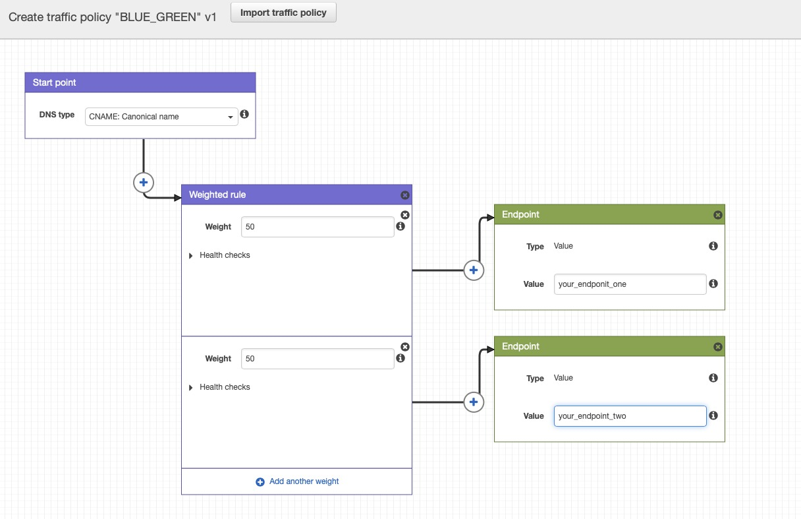

# aws-cloudfoundation-vpc-parameters

# Lab enviroment will be consist of 4 CFN templates and 2 json files 
1. VPC teamplete 
2. Security group template
3. 2x pulbic instance template

#Project requirements
- Create VPC, routes tables, subnet tables and export outputs 
- Create security group with necesory permissions ( ssh, https , http )
- Create web server 1 with http service 
- Create web server 2 with http service
- Update CNAME record in route53 and point to EC2 web servers
- Setup traffic Policies 
- Update CNAME record with AWS CLI & json template 
- Cleanup

# Steps
## 1. Create VPC, routes tables, subnet tables and export outputs 
- [vpc.yaml](./Templates/vpc.yaml)

```bash
aws cloudformation create-stack --stack-name sgpvpc --template-body file://vpc.yaml --parameters ParameterKey='VPCCIDR',ParameterValue='192.168.0.0/16' ParameterKey='PublicSubnet1CIDR',ParameterValue='192.168.1.0/24' ParameterKey='PublicSubnet2CIDR',ParameterValue='192.168.2.0/24' ParameterKey='PublicSubnet3CIDR',ParameterValue='192.168.3.0/24' ParameterKey='RegionCode',ParameterValue='sgp' ParameterKey='AZ1Code',ParameterValue='sgpaz1' ParameterKey='AZ2Code',ParameterValue='sgpaz2' ParameterKey='AZ3Code',ParameterValue='sgpaz3'
```
## 2. Create security group with necesory permissions ( ssh, https , http )
- [vpc-securitygroup.yaml](./Templates/vpc-securitygroup.yaml)

```bash
aws cloudformation create-stack --stack-name sgvpc-securitygroup --template-body file://vpc-securitygroup.yaml --parameters ParameterKey='vpcStackName',ParameterValue='sgpvpc' 
```

## 3.Create web server 1 with http service
- [public-instance-v1.yaml](./Templates/public-instance-v1.yaml)

```bash
aws cloudformation create-stack --stack-name instancev1 --template-body file://public-instance-v1.yaml --parameters ParameterKey='vpcStackName',ParameterValue='sgpvpc' ParameterKey='vpcSecurityGroupStackName',ParameterValue='sgvpc-securitygroup' ParameterKey='appVersion',ParameterValue='v1'
```
Test result : 
```
curl -k ec2-54-251-20-48.ap-southeast-1.compute.amazonaws.com
<html><h1 align='center'><p style='color:blue'>This Is kumoribay - app v1</p></h1></html>
```

## 4.Create web server 2 with http service
- [public-instance-v2.yaml](./Templates/public-instance-v2.yaml)

```bash
aws cloudformation create-stack --stack-name instancev2 --template-body file://public-instance-v2.yaml --parameters ParameterKey='vpcStackName',ParameterValue='sgpvpc' ParameterKey='vpcSecurityGroupStackName',ParameterValue='sgvpc-securitygroup' ParameterKey='appVersion',ParameterValue='v2'
```
Test result : 
```
curl -k ec2-54-169-186-208.ap-southeast-1.compute.amazonaws.com
<html><h1 align='center'><p style='color:blue'>This Is kumoribay - app v2</p></h1></html>
```

## 5. Manual Update CNAME record in route53 AWS Console GUI and point to EC2 web servers


## 6. Setup traffic Policies
Configure traffic policy using Traffic Policy Wizzard. 

### i) Define the traffic policy


### ii) Apply under your domain


### iii) Test Result 
```
while sleep 0.9; do curl -k "http://app.kumoribay.com"; done
```

## 7. Update CNAME record with AWS CLI & json template
Ref URL : [DNS-ChangeRecordSet](https://docs.aws.amazon.com/cli/latest/reference/route53/change-resource-record-sets.html)

- **CREATE** : Creates a resource record set that has the specified values.
- **DELETE** : Deletes an existing resource record set that has the specified values.
- **UPSERT** : If a resource record set does not already exist, AWS creates it. If a
               resource set does exist, Route 53 updates it with the values in the
               request.

Generate existing route53 record-set output and edit. 

```
aws route53 change-resource-record-sets --generate-cli-skeleton
{
    "HostedZoneId": "",
    "ChangeBatch": {
        "Comment": "",
        "Changes": [
            {
                "Action": "CREATE",
                "ResourceRecordSet": {
                    "Name": "",
                    "Type": "AAAA",
                    "SetIdentifier": "",
                    "Weight": 0,
                    "Region": "af-south-1",
                    "GeoLocation": {
                        "ContinentCode": "",
                        "CountryCode": "",
                        "SubdivisionCode": ""
                    },
                    "Failover": "PRIMARY",
                    "MultiValueAnswer": true,
                    "TTL": 0,
                    "ResourceRecords": [
                        {
                            "Value": ""
                        }
                    ],
                    "AliasTarget": {
                        "HostedZoneId": "",
                        "DNSName": "",
                        "EvaluateTargetHealth": true
                    },
                    "HealthCheckId": "",
                    "TrafficPolicyInstanceId": ""
                }
            }
        ]
    }
}
```
Modified output: 
- [app-v1.json](./Json/app-v1.json)<br>
- [app-v2.json](./Json/app-v2.json)<br>
- [delete-record.json](./Json/delete-record.json)

Change the DNS CNAME Record to V1 App with AWS CLI 
```
aws route53 change-resource-record-sets --hosted-zone-id Z054322716IAFQNFTJD4K --change-batch file://../Json/app-v1.json

{
    "ChangeInfo": {
        "Id": "/change/C092832210HU18H0BR8I1",
        "Status": "PENDING",
        "SubmittedAt": "2021-07-27T05:14:51.356000+00:00",
        "Comment": "Update from AWS CLI to V1 APP"
    }
}
``` 
Change the DNS CNAME Record to V2 App with AWS CLI
```
 aws route53 change-resource-record-sets --hosted-zone-id Z054322716IAFQNFTJD4K --change-batch file://../Json/app-v2.json

{
    "ChangeInfo": {
        "Id": "/change/C00264061Z4N1L1SO8M2K",
        "Status": "PENDING",
        "SubmittedAt": "2021-07-27T05:17:36.692000+00:00",
        "Comment": "Update from AWS CLI to V1 APP"
    }
}
```

Verify Change status: 
```
aws route53 get-change --id /change/C00264061Z4N1L1SO8M2K
{
    "ChangeInfo": {
        "Id": "/change/C00264061Z4N1L1SO8M2K",
        "Status": "INSYNC",
        "SubmittedAt": "2021-07-27T05:17:36.692000+00:00",
        "Comment": "Update from AWS CLI to V1 APP"
    }
```

## 8. Cleanup

i) Remove DNS CNAME record 
```
aws route53 change-resource-record-sets --hosted-zone-id Z054322716IAFQNFTJD4K --change-batch file://../Json/delete-record.json
{
    "ChangeInfo": {
        "Id": "/change/C06296111VAF0XIP9BBNJ",
        "Status": "PENDING",
        "SubmittedAt": "2021-07-27T05:35:24.150000+00:00",
        "Comment": "Update from AWS CLI to V1 APP"
    }
}
```
ii) list your stack  with python script 
- [list-stack.sh](./Cleanup/list-stack.sh)

```
➜  Python git:(main) ✗ python3 list-stack.py 
instancev2
instancev1
sgvpc-securitygroup
sgpvpc
```

iii) Delete your Stack 

- [delete-stack.sh](./Cleanup/delete-stack.sh)
```
./delete-stack.sh &
```